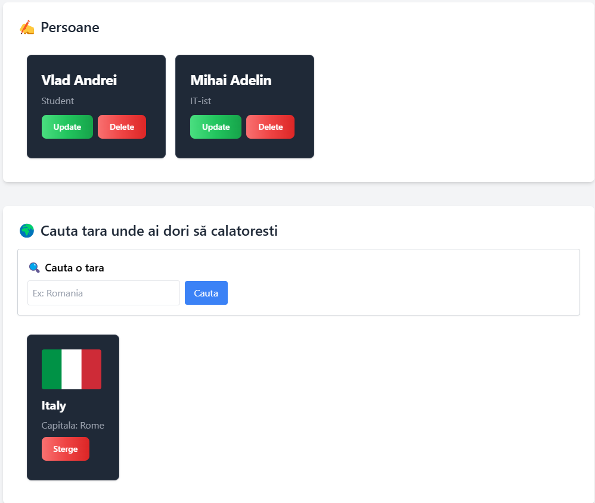

#INTRODUCERE

Proiectul se bazeaza pe doua servicii in cloud intr-o aplicatie web simpla si functionala si a fost realizat pentru materia Cloud Computing.Aplicația e construită cu Next.js și este organizată astfel incat sa fie usor de folosit, dar si ușor de extins in viitor.

Aplicatia are doua parti principale:

1.Prima secțiune este un modul de tip CRUD, unde utilizatorul poate crea, citi, edita sau sterge inregistrări.Fiecare record contine un nume si o descriere, iar toate datele sunt salvate în baza de date MongoDB Atlas, gazduita in cloud. Aceasta parte mi-a permis sa aplic practic lucrul cu baze de date cloud si sa înțeleg cum functionează un API personalizat pentru operatii pe date.

2.A doua secțiune este un wishlist cu destinatii. Utilizatorul poate cauta o tara folosind un API public (REST Countries), vede informatii precum steagul, capitala si limba oficiala, și poate salva acea tara intr-un wishlist. Datele sunt salvate tot în MongoDB Atlas, dar partea interesanta e integrarea cu un serviciu extern (REST API), care ofera date live.

Prin acest proiect am reusit să folosesc două servicii cloud:
- un API public pentru date externe
- o bază de date în cloud pentru stocarea informatiilor personale

#DESCRIERE APLICATII FOLOSITE

1.MongoDB Atlas

MongoDB Atlas este un serviciu cloud care ofera o baza de date NoSQL. L-am folosit pentru a salva doua tipuri de date:
- Persoane, care conțin un `name` si un `description` – adaugate de utilizator
- Tari favorite, salvate de utilizator dupa ce le cauta in aplicatie

Am creat doua colectii diferite in baza de date:
- records:  pentru partea de CRUD
- wishlist:  pentru wishlist-ul cu tari

Datele sunt accesate si manipulate prin API-urile proprii scrise in `/api/records` si `/api/wishlist`, folosind Next.js.

2. REST Countries API

Am folosit si un serviciu public, gazduit in cloud, numit REST Countries API. Acesta returneaza date despre tari in format JSON. Eu l-am folosit pentru a:
- cauta tari după nume
- afisa steagul, capitala, limba, moneda
- salva acea tara in wishlist

Utilizatorul scrie numele unei tari, aplicatia face un fetch catre API-ul public, iar apoi informatiile primite pot fi salvate in baza mea de date in cloud (MongoDB Atlas).

#Capturi de ecran

-
-[Persoane](./public/screenshots/persoane.png)
-[Tari](./public/screenshots/tari.png)

Link youtube: https://www.youtube.com/watch?v=Mzm15pfyKhU